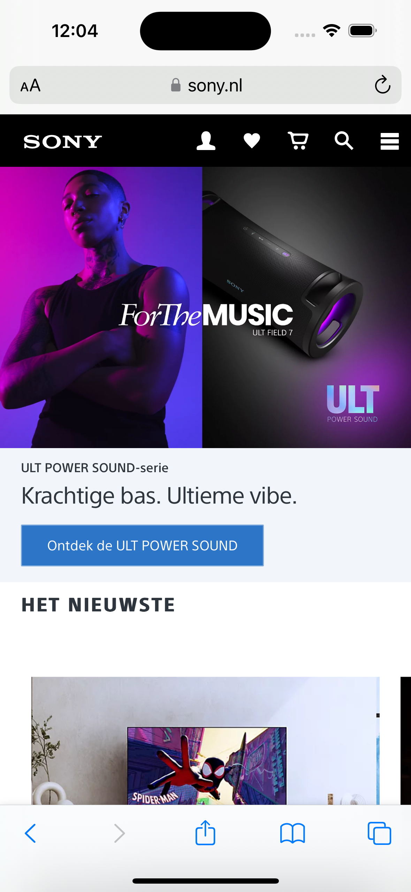
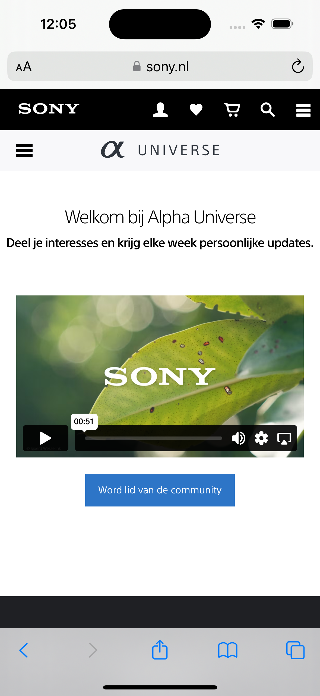
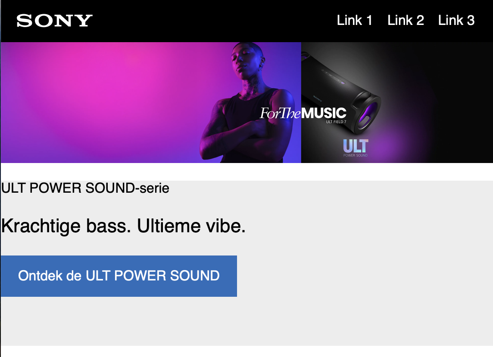
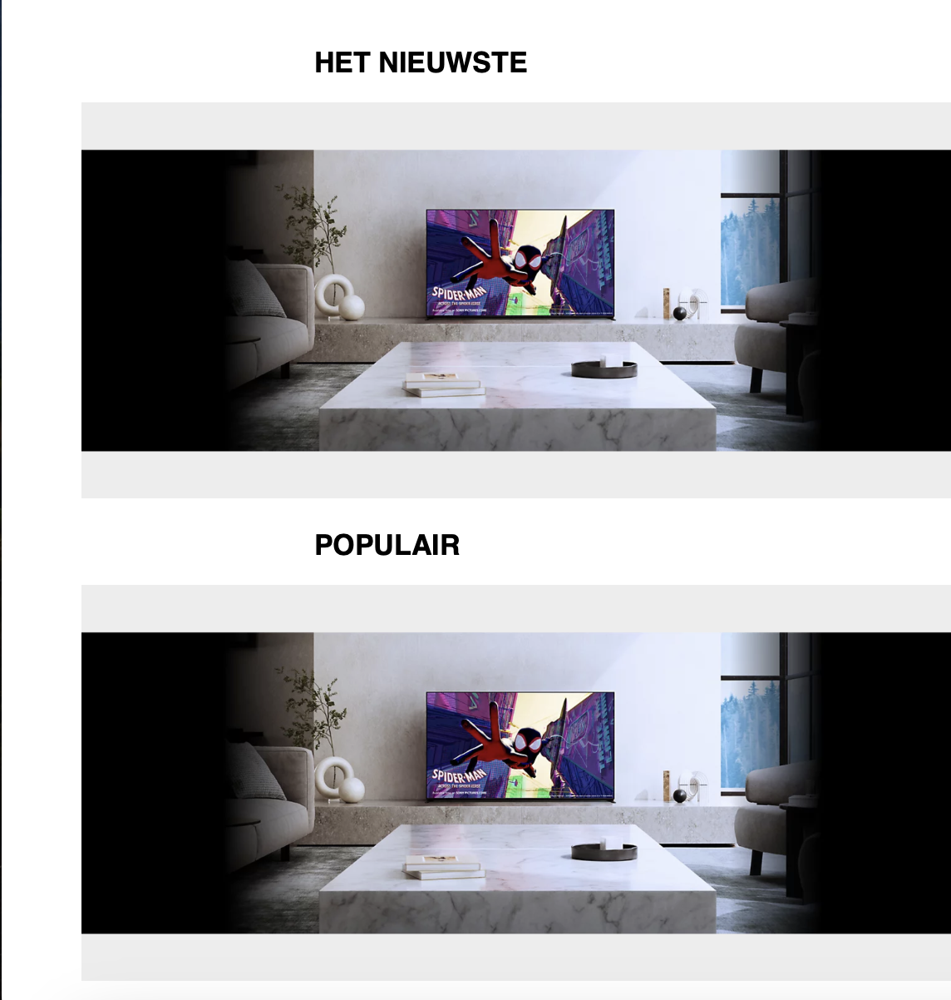
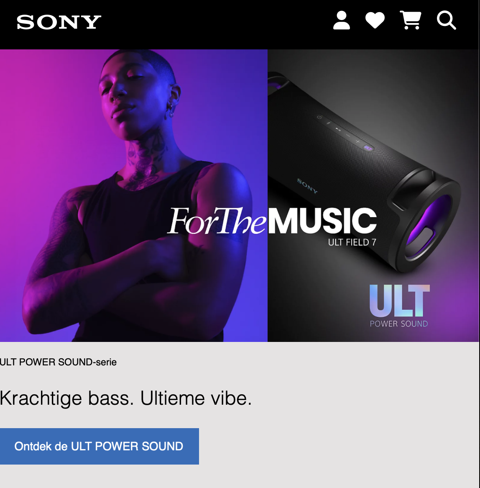
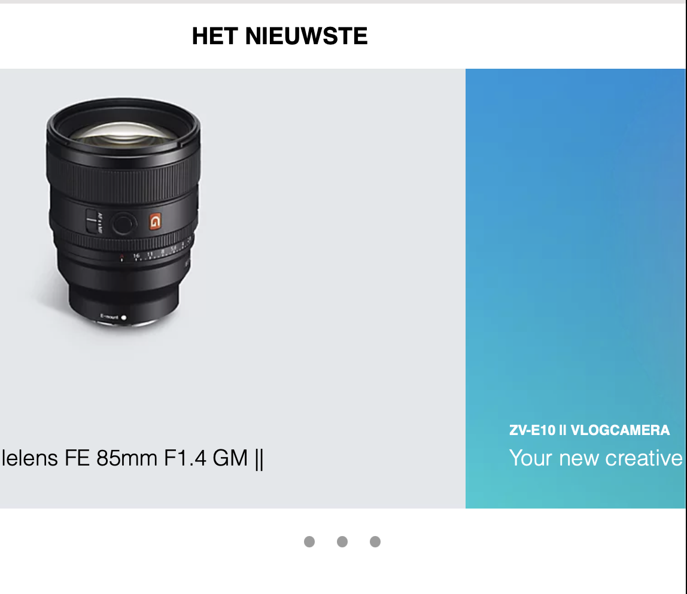
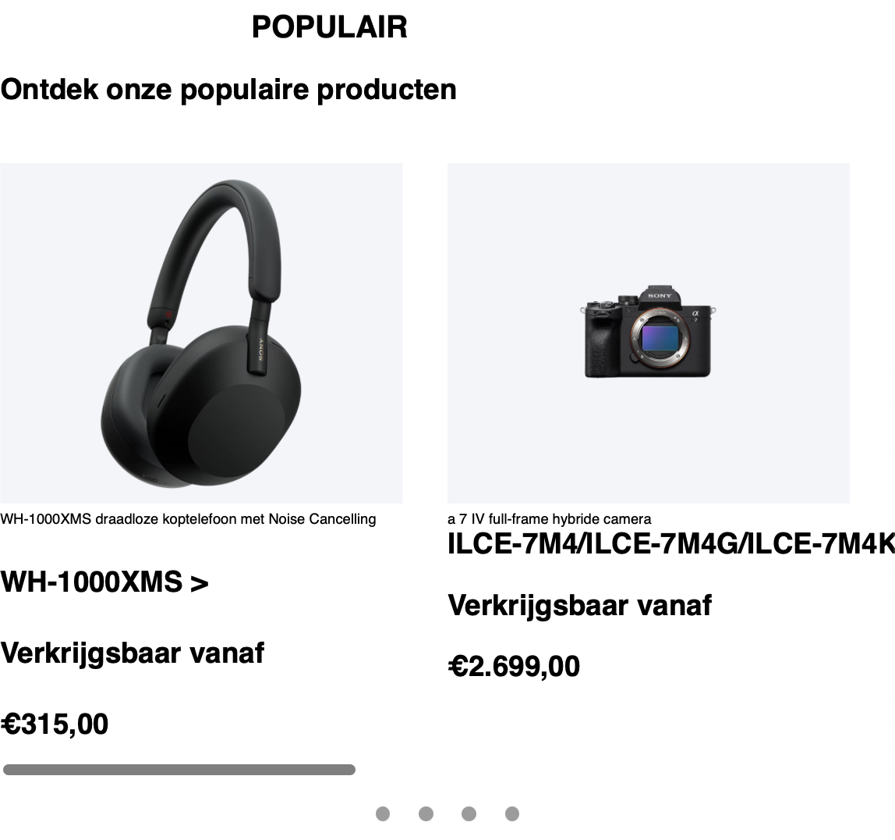

# Procesverslag
Markdown is een simpele manier om HTML te schrijven.  
Markdown cheat cheet: [Hulp bij het schrijven van Markdown](https://github.com/adam-p/markdown-here/wiki/Markdown-Cheatsheet).

Nb. De standaardstructuur en de spartaanse opmaak van de README.md zijn helemaal prima. Het gaat om de inhoud van je procesverslag. Besteedt de tijd voor pracht en praal aan je website.

Nb. Door *open* toe te voegen aan een *details* element kun je deze standaard open zetten. Fijn om dat steeds voor de relevante stuk(ken) te doen.

## Jij

  
uitwerken voor kick-off werkgroep

  ### Auteur:
  Michelle Stendert

  #### Je startniveau:
  Blauw

  #### Je focus:
  Surface plane
 

## Je website

  
uitwerken voor kick-off werkgroep

  ### Je opdracht:
  https://www.sony.nl

  #### Screenshot(s) van de eerste pagina (small screen): Home
  

  #### Screenshot(s) van de tweede pagina (small screen): Toegankelijkheid
  
 

## Toegankelijkheidstest 1/2 (week 1)

  
uitwerken na test in 2e werkgroep

(afbeeldingen invoegen over test)

Bevindingen screenreader test

**Tijdens**
- Gaat elk element in de website af, noemt elementen die niet voor een gebruiker van toepassing zijn (html elementen)
- Scrollt door elke carousel heen - vervelend, teveel informatie
- Vertelt wat er te zien is op de afbeeldingen door de alt tekst
- hartje voor favorieten wordt niet als button besproken, er is dus missende informatie, geldt voor alle producten
- Reviews worden niet besproken bij de producten
- Screenreader begint bij het einde onderin, geeft wel aan dat het een link is
- Blijft hangen bij laatste carousel, gaat alleen nog maar door de carousel
- Screenreader komt niet bij Universe en footer door vorig punt

**Achteraf**
- Heel veel informatie die word verteld, gaat maar door zonder pauzes
- Afbeeldingen hebben veel tekst die afleiden van het doel en content

## Breakdownschets (week 1)

  
uitwerken na afloop 3e werkgroep

  ### de hele pagina: 
  

  ### dynamisch deel (bijv menu): 
  

  ### wellicht nog een dynamisch deel (bijv filter): 
  

## Voortgang 1 (week 2)

  
uitwerken voor 1e voortgang

  ### Stand van zaken
  hier dit ging goed & dit was lastig (neem ook screenshots op van delen van je website en code)
  ik had moeite met de opzet van de website, de basis krijgen is voor mij lastig. Ik begrijp de theorie als ik dit hoor en lees, 
  maar het zelf toepassen van deze theorie vind ik lastig. Nadat ik de basis had opgezet ging het toevoegen van de afbeeldingen en juiste elementen een stuk gemakkelijker.

  
  

  ### Agenda voor meeting
  samen met je groepje opstellen

  | Michelle              | Student 2          | Student 3    | Student 4        |
  | ---                   | ---                | ---          | ---              |
  | Header afbeelding     | en dit             | en ik dit    | en dan ik dat    |
  | Opbouw homepage       | dit als er tijd is | nog een punt | dit wil ik zeker |
  | iconen in navigatie   | ...                | ...          | ...              |

  ### Verslag van meeting
  hier na afloop snel de uitkomsten van de meeting vastleggen

- Logo is de h1 van de homepagina
- H1 is titel van de pagina (waar gaat de pagina over)
- Section - flexbox - articles f
- 2e section is een grid - aanspreken door “end of type”
- Bij de promoties & aanbiedingen kan je alleen de linkjes erin zetten
- Er wordt gebruik gemaakt van een thematische groepering
- Onderbouwen - diversiteit (in de carousels)
- Div alleen gebruiken voor vormgeving (in de carousel) 
- Svg als icoon, deze kan je stylen in css
- Afbeeldingen hoeven geen alt test als het geen toegevoegde waarde heeft
- 2e pagina heeft class nodig voor css
Class op body zetten - ligt eraan welke pagina moeilijker is (makkelijkste krijgt class)

## Voortgang 2 (week 3)

  
uitwerken voor 2e voortgang

  ### Stand van zaken
  Ik ben verder gegaan met het coderen van de website, heb vee moeite gehad om de carousels op te zetten, maar heb hier hulp voor gevraagd en is het uitgelegd hoe het in elkaar zit en hoe ik het het beste kan aanpakken. Dit heb ik ook geprobeerd en ben uiteindelijk gekomen bij een resultaat waar ik tevreden mee ben. Dit heeft deze week de meeste tijd ook ingenomen. Nu die basis staat kan ik verder met de rest van de content coderen.

  
  
  

  ### Agenda voor meeting
  samen met je groepje opstellen

  | Michelle                                 | student 2          | student 3    | student 4        |
  | ---                                      | ---                | ---          | ---              |
  | Scrollbar laten verdwijnen               | en dit             | en ik dit    | en dan ik dat    |
  | text align left | dit als er tijd is     | nog een punt       |              |  dit wil ik zeker|
  | surface plane vanuit theorie in lessen   | ...                | ...          | ...              |

  ### Verslag van meeting
  hier na afloop snel de uitkomsten van de meeting vastleggen

  - Scrollbar laten verdwijnen is niet nodig, hde carousel is al goed genoeg
  - Vanuit de surface kant wordt er niet getld hoeveel elementen erin zitten, het gaat erom dat je je code begrijpt
  - De h2's van de homepage konden niet links uitgelijnd worden, omdat ik alle h2's had aangesproken om een grote margin te hebben aan de linkerkant
  - De eindgesprekken worden volgende week (in week 4) ingepland, dit kan verplaatst worden indien nodig

## Toegankelijkheidstest 2/2 (week 4)

  
uitwerken na test in 9e werkgroep

  ### Bevindingen
  Lijst met je bevindingen die in de test naar voren kwamen (geef ook aan wat er verbeterd is):

## Voortgang 3 (week 4)

  
uitwerken voor 3e voortgang

  ### Stand van zaken
Aangezien het ondertussen alweer week 4 is en de laatste week om alles af te ronden, heb ik wel even stress gekregen. Mijn website was al op schema ongeveer, maar de afronding kan je zeker niet onderschatten. Hierbij heb ik toch wat moeten gebruiken waar ik niet heel veel van snapte en erg lastig vond: grid. Een oud-klasgenoot heeft mij uitgelegd hoe dit een beetje in zijn werk ging. Ook heb ik deze week veel op youtube en google gezeten voor kleine obstakels waar ik tegenaan liep (deze bronnen heb ik ook vastgelegd). Over het algemeen ben ik best wel trots op mijn website, aan het begin van het vak wilde ik het zo snel mogelijk afronden, maar wist ik niet dat ik zoveel zou leren en uiteindelijk ook niet zo slecht zou zijn als ik dacht. Feedback is nu mijn grootste zorg samen met de kleine puntjes op de "i" vind ik. Ik ben nu bezig om een aantal elementen af te ronden, ik moet dan alleen nog even focussen op de "surface plane" onderdelen/elementen. Daar moet ik namelijk nog een paar van toevoegen. 🤞🏻

  ### Agenda voor meeting
  samen met je groepje opstellen

  | student 1                                                                | student 2          | student 3    | student 4        |
  | ---                                                                      | ---                | ---          | ---              |
  | zoekbalk laten werken, wat word daar precies mee bedoelt (in hoeverre)?  | en dit             | en ik dit    | en dan ik dat    |
  | feedback over de website pagina(s) in het algemeen                       | dit als er tijd is | nog een punt | dit wil ik zeker |
  | focus state (safari / chrome)                                            | ...                | ...          | ...              |
  | Je uitkomst - karakteristiek screenshots(?)                              | ...                | ...          | ...              |

  ### Verslag van meeting
  hier na afloop snel de uitkomsten van de meeting vastleggen

  - Wat ik nu had gemaakt is goed, ik wil het zelf alleen nog verder gaan stylen
  - Ziet er goed uit, de docent merkt dat ik er trots op ben en veel heb geleerd (alleen nog even kijken naar koppen).
  - Dat is een instelling in safari zelf die ervoor zorgt dat je alleen kan tabben binnen de elementen van safari zelf.
  - Foto's van je website, wat heb je uiteindelijk gemaakt?

## Eindgesprek (week 5)

  
uitwerken voor eindgesprek

  ### Je uitkomst - karakteristiek screenshots:
  

  ### Dit ging goed/Heb ik geleerd: 
  Korte omschrijving met plaatjes

  

  ### Dit was lastig/Is niet gelukt:
  Korte omschrijving met plaatjes

  

## Bronnenlijst

  
continu bijhouden terwijl je werkt

  Nb. Wees specifiek ('css-tricks' als bron is bijv. niet specifiek genoeg). 
  Nb. ChatGpT en andere AI horen er ook bij.
  Nb. Vermeld de bronnen ook in je code.

  1. [How to add a link to a picture?](https://developer.mozilla.org/en-US/docs/Learn/HTML/Multimedia_and_embedding/Images_in_HTML)
  2. [Define scroll-padding-top and how to use?](https://developer.mozilla.org/en-US/docs/Web/CSS/scroll-padding-top) (bron: Sanne 't Hooft)
  3. [How to smooth scroll?](https://www.w3schools.com/howto/howto_css_smooth_scroll.asp)
  4. [How to mute a video automatically?](https://youtu.be/Ki_0iES2cGI?si=kfSUTSU9wwX2ETPk)
  5. [How maak je een invulbalk?]([https://youtu.be/Ki_0iES2cGI?si=kfSUTSU9wwX2ETPk](https://youtu.be/u8jfMY8GcGI?si=kC6MjCPLgc9XRTM8))
  6. Kim Dekker - Uitleg en richtlijn over grid

